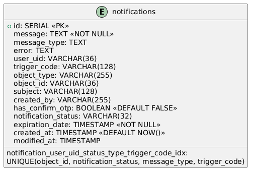

# Файловое хранилище (Rest API)

Данное приложение разработано с для работы с брокером сообщений Kafka.

API позволяет производить следующие операции:
- создание сообщения в Kafka через POST-запрос (только для тестирования)
- просмотр всех обработанных сообщений (Notifications) с постраничным выводом;
- просмотр сообщения (Notification) по id;
- изменение статуса сообщения с NEW на COMPLETE.

Приложение тестируется интеграционными тестами.

## Информация

1. **Версия API** указывается в URI. Текущая версия: `v1` (например, "localhost:8088/api/v1/notifications).

Component-diagram:


Sequence-diagram:


ER-diagram:


## Требования

Для работы приложения требуется следующее программное обеспечение:
1. **Java Development Kit** (JDK) версии не ниже 21;
2. **Docker**.

## Запуск

Для запуска приложения скачайте проект в нужную директорию:
```bash
git clone https://gitlab.leantech.ai/javateamio/kafka-notification-rest-api.git
```

Перейдите в директорию проекта:
```bash
cd kafka-notification-rest-api
```

Запустите Docker, и введите в командную строку
```bash
docker-compose up --build
```
Приложение будет запущено по адресу `http://localhost:8088/`